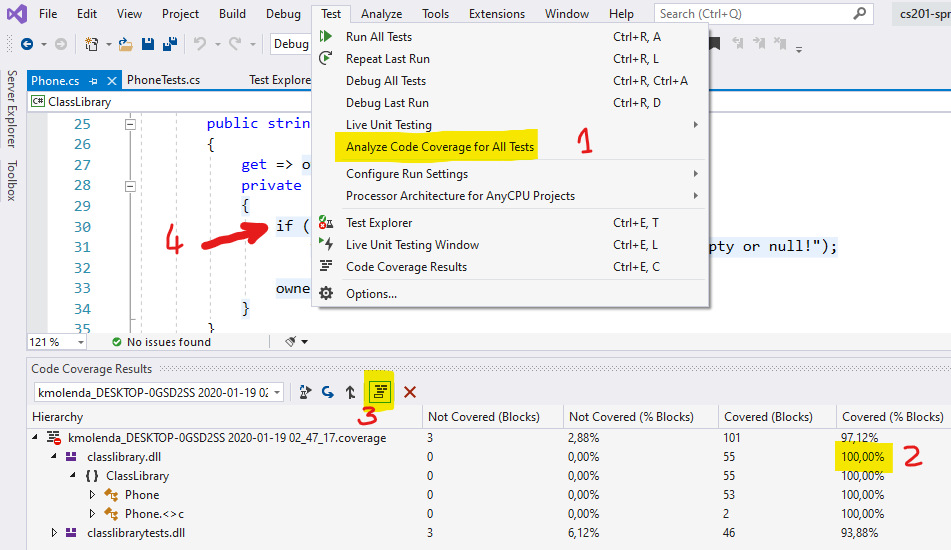

### Klasa 'Phone' - testy jednostkowe

> Autor: _Krzysztof Molenda_
>
> Wersja: 0.1 (2019.12.10)

W pliku `Phone.cs` zawarta jest klasa `Phone`.

Twoim zadaniem jest napisanie testów jednostkowych:

1. weryfikujących poprawność implementacji,
2. pokrywających jak największą część kodu klasy `Phone` (idealnie 100%).

Tworząc testy rozważ zarówno przypadki poprawnego użycia metod, jak i takie, które zgłaszają wyjątki.

> Uwaga: pokrycie kodu nawet w 100% nie oznacza, że wszystkie przypadki zostały uwzględnione w testach.

Do oceny przesyłasz skompresowane w formacie `zip` _solution_ z odpowiednimi projektami. Ocena za zadanie wynika bezpośrednio ze wskaźnika pokrycia kodem klasy `Phone` oraz uwzględnienia wszystkich przypadków testowych potwierdzających poprawność implementacji.

> Podpowiedź: Jeśli korzystasz z VisualStudio 2019, pokrycie kodu poznasz, wybierając z menu `Test` polecenie `Analze Code Coverage for All Tests` (1). Następnie, w konsoli `Code Coverage Results`, zobaczysz wyniki liczbowe (2). Klikając na przycisk `Show Code Coverage Coloring` (3) zobaczysz pokolorowaną składnię, pokazującą które fragmenty kodu zostały pokryte testami, a które nie (4).
>
> 
